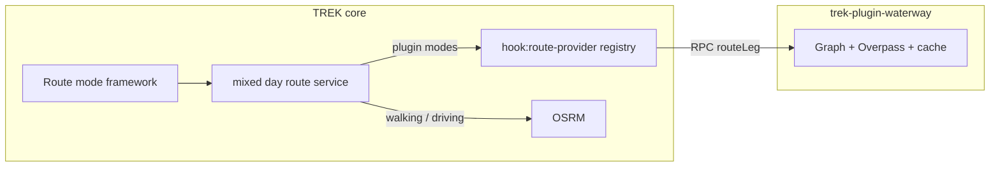

# PRD: Day-plan route modes with plugin route providers

Status: local, ready-for-agent.
Source: architecture plan + grill session (Jul 2026).
Delivery: hybrid — TREK core (route-mode framework + `hook:route-provider`) and `trek-plugin-waterway` (integration plugin, separate repo).

## Problem Statement

TREK’s day planner needs extensible **route modes** for itinerary legs: built-in walking and driving (OSRM), plus optional modes such as **waterway** routing over OpenStreetMap waterways. A full waterway implementation was prototyped on `feature/waterways` as a large core change (schema, server orchestration, workspace package, Overpass in the server process). That shape is unlikely to be accepted upstream now that the **plugin architecture** has launched: it couples an optional, operator-sensitive capability (Overpass load, caching, egress) to core, increases review surface, and does not demonstrate how integration plugins extend the planner.

At the same time, a **pure plugin** cannot deliver full day-plan integration today. Plugins cannot persist trip/assignment route preferences, participate in mixed-mode day routing, draw on the core map, or replace the server-owned day-route endpoint. The gap is missing **plugin infrastructure**: a route-provider hook, a host registry, and a thin route-mode framework in core.

There are **no production installations** of `feature/waterways`; delivery can assume a greenfield data model with no migration for legacy waterway rows.

## Solution

Ship in two coordinated tracks on a **shared development branch**, then split into separate PRs at release:

1. **TREK core (upstream PR)** — Route-mode domain model and server-owned **mixed day route calculation** for built-in modes, plus generic infrastructure for **plugin route providers**. Core owns orchestration, schema, planner UI, map rendering, accommodation bookend legs, and OSRM adapters. It does **not** include Overpass, the waterway graph engine, or a monorepo waterway package.

2. **`trek-plugin-waterway` (separate repo + registry)** — First consumer of `hook:route-provider`. Vendors the waterway routing algorithm (from `@trek/waterway-routing` on the feature branch), Overpass egress, and an instance-owned cache. Manifest id: `waterway`.

The credible upstream story is **extensible day-plan route modes with providers supplied by plugins**, not a rowing/waterway feature bundled in core.



## User Stories

### Maintainers and upstream

1. As a TREK maintainer, I want route-mode extensibility framed as plugin infrastructure, so that upstream review focuses on a reusable hook rather than a domain-specific waterways feature.
2. As a TREK maintainer, I want Overpass and waterway graph logic out of the core server process, so that operational risk and egress are isolated to an optional plugin child process.
3. As a TREK maintainer, I want CI for core to depend only on OSRM built-in modes, so that tests do not require Overpass or a waterway package build in the monorepo.
4. As a TREK maintainer, I want a single provider per route mode, so that mode dispatch is deterministic and misconfiguration fails at plugin activation.
5. As a TREK maintainer, I want shared host→child hook invoke infrastructure, so that future integration hooks (photo, calendar) reuse the same pattern without copy-paste registries.
6. As a plugin author, I want a documented `RouteProvider` interface and manifest capabilities for route modes, so that I can ship additional modes (e.g. off-road, ski) without core changes.

### Trip planning — modes and persistence

7. As a trip planner, I want to set a default day-plan route mode for a trip, so that new legs use my preferred way of moving between stops.
8. As a trip planner, I want to override the route mode on individual place assignments, so that one leg can differ from the trip default.
9. As a trip planner, I want an explicit “inherit from trip” choice on assignments, so that I can revert a per-leg override without guessing what null means.
10. As a trip planner, I want to configure mode-specific options (e.g. waterway speed) in the trip form when relevant, so that duration estimates match my activity.
11. As a trip planner, I want plugin route modes to appear in selectors only when an active plugin registers them, so that I am not offered modes the instance cannot calculate.
12. As a trip planner, I want the API to reject saving a plugin mode when no provider is active, so that trips cannot be left in a broken configuration.
13. As a trip planner switching days quickly, I want in-flight route work for the previous day to cancel, so that stale geometry does not overwrite the map.

### Trip planning — routing and map

14. As a trip planner, I want one server endpoint to return the full mixed day route, so that the client does not choose providers or merge incompatible response shapes.
15. As a trip planner, I want walking and driving legs routed via OSRM without installing a plugin, so that basic planning always works.
16. As a trip planner with the waterway plugin active, I want waterway legs routed along navigable OSM waterways, so that map polylines follow rivers and canals rather than straight lines.
17. As a trip planner on a day with a hotel, I want hotel-to-first-stop and last-stop-to-hotel route legs included in the server response, so that accommodation-aware routes stay visible when server geometry succeeds.
18. As a trip planner, I want approximate straight-line fallbacks when a leg’s provider fails, so that the map and sidebar remain usable with a clear “approximate” indication.
19. As a trip planner, I want localized labels for built-in route modes, so that the UI matches my language.
20. As a trip planner, I want plugin mode labels from the plugin manifest when no core translation exists, so that optional modes remain understandable in v1.
21. As a trip planner on a waterway-effective day, I want “optimize route” disabled when the mode disallows it, so that I do not reorder stops in a way that implies false navigability.
22. As a trip planner, I want sidebar route pills and map polylines to agree, so that structured route legs from the server drive both surfaces.

### Mixed modes and transports

23. As a trip planner, I want transport bookings to split the day itinerary into separate route runs, so that flights and trains break continuous routing correctly.
24. As a maintainer, I want transport types to remain distinct from day-plan route modes, so that booked transport is not conflated with walking/driving/waterway preferences.
25. As a route-mode implementer, I want a shared pure module to build day route runs from days, assignments, and reservations, so that client and server do not duplicate transport-splitting rules.

### Plugin operator and waterway plugin

26. As an instance admin, I want to install and activate `trek-plugin-waterway` from the plugin registry, so that waterway mode becomes available without core redeploy.
27. As an instance admin, I want declared Overpass egress and an instance-level mirror URL setting, so that I can control external dependencies.
28. As an operator, I want Overpass responses cached in the plugin’s own database, so that repeated legs do not hammer public Overpass instances.
29. As an operator, I want route-provider RPC cancelled when the user aborts a day-route request, so that timed-out or abandoned work does not continue in the plugin child.
30. As a developer, I want to develop core and the waterway plugin in parallel on a shared branch, so that integration is validated before upstream merge.

### Testing and quality

31. As a maintainer, I want mixed day route behavior tested through the same interface the client uses, so that regressions are caught at the right seam.
32. As a maintainer, I want the day-route itinerary module tested as a pure function, so that transport splits and effective mode resolution are stable.
33. As a maintainer, I want plugin registry conflict and activation failure covered by tests, so that duplicate mode providers cannot slip into production silently.

## Implementation Decisions

### Strategic split

- Do **not** upstream `feature/waterways` wholesale. Use it as design reference and code source; cherry-pick and rewrite at the orchestration vs engine seam.
- Core PR pitch: **extensible day-plan route modes with routing providers supplied by plugins**.
- Waterway ships as **`trek-plugin-waterway`** (repo name); plugin manifest **`id`: `waterway`**.
- Develop core and plugin **in parallel** on a shared branch; split into core upstream PR vs plugin registry PR at ship time.

### Deep modules (build or modify)

| Module | Role | Depth |
|--------|------|--------|
| **Day route itinerary** | Pure logic: assignments + transports → route runs; effective mode (`override` → trip default → walking); `inherit` sentinel → null | Deep — canonical seam, heavily tested in isolation |
| **Mixed day route service** | Server orchestrator: bookend legs + per-run legs; built-in OSRM; dispatch plugin modes via registry; per-leg fallback and `isApproximate` | Deep — main behavioral owner |
| **Route provider registry** | Maps mode string → active plugin; activation-time conflict detection; dispatches `routeLeg` via supervisor | Deep — small interface, encapsulates plugin RPC |
| **Hook invoke channel** | Shared host→child invoke for integration hooks; cancel by invoke id; v1 wires route-provider only | Deep — reusable for photo/calendar later |
| **Route modes API** | `GET /api/route-modes`: built-ins + active plugin modes, labels, `allowsOptimize`, option schemas | Shallow — aggregation over registry + static built-ins |
| **Plugin SDK surface** | `RouteProvider`, `RouteLegRequest`, `RouteLegResult`; manifest `capabilities.routeModes`; permission `hook:route-provider` | Shallow types, stable contract |
| **Planner route UI** | Trip form, assignment inspector, map hook, optimize guard — gated on `/api/route-modes` | Orchestration — consumes server contract |
| **Waterway plugin server** | Vendored graph/routing JS, Overpass via child `fetch` + egress, `db:own` cache, `hooks.routeProvider` | Deep — isolated in child process |

### Domain model and schema

- **Trip**: `default_route_mode` (string); `route_mode_options` (JSON object keyed by mode id).
- **Assignment**: `route_mode_override` (string nullable); `'inherit'` stored in API/DB, normalized to null for effective mode resolution.
- **No** waterway-specific columns in core (e.g. no `waterway_speed_kmh`). Waterway speed lives under `route_mode_options.waterway.speedKmh` (exact key from manifest option schema).
- **Built-in modes** (core, always available): `walking`, `driving` — routed via OSRM in core.
- **Plugin modes**: dynamic strings registered at runtime (e.g. `waterway`). Write validation: persisted mode must be built-in or currently registered. UI selectors list only built-ins + registered modes.

### Route provider contract

From plugin-sdk (decision-rich shape):

```ts
interface RouteLegRequest {
  mode: string;
  from: { lat: number; lng: number };
  to: { lat: number; lng: number };
  legKey: string;
  tripId: number;
  modeOptions?: Record<string, unknown>; // slice of trip.route_mode_options[mode]
}

interface RouteLegResult {
  coords: [number, number][];
  distanceM: number;
  durationS?: number;
  isApproximate?: boolean;
}

interface RouteProvider {
  modes(): string[];
  routeLeg(req: RouteLegRequest): Promise<RouteLegResult>;
}
```

- Host passes **mode options** from trip JSON; host does not interpret waterway-specific fields.
- **Abort**: not serialized on the request. Host tracks invoke id; on `AbortSignal` abort, sends **cancel** to child; child aborts in-flight `fetch` via per-invoke `AbortController`.

### Manifest capabilities (plugin)

```json
"capabilities": {
  "routeModes": [{
    "mode": "waterway",
    "label": "Waterway",
    "allowsOptimize": false,
    "options": [{
      "key": "speedKmh",
      "type": "number",
      "label": "Speed (km/h)",
      "min": 1,
      "max": 30,
      "default": 6
    }]
  }]
}
```

- Core validates trip `route_mode_options` against active providers’ option schemas on save.
- Core renders generic option fields (number/text) from schema in trip form.
- **Labels**: built-in modes use core i18n; plugin modes use manifest `label` (English) in v1.

### Registry and activation

- On plugin load with `hook:route-provider`, register declared `capabilities.routeModes[].mode` → plugin id.
- **Conflict policy**: if a mode is already claimed, **reject activation** with a clear error.
- Permission: `hook:route-provider` added to known permissions (alongside existing photo/calendar hook permissions).

### Mixed day route behavior

- **Endpoint**: `GET /trips/:tripId/days/:dayId/route` remains in core; response shape includes segments, structured legs, bookend legs.
- **Bookends**: server-owned — accommodation context fed into mixed day route service; hotel→first / last→hotel legs included in response (OSRM walking/driving). Eliminates half-owned client overlay when server geometry succeeds.
- **Provider missing at route time** (plugin deactivated mid-session): per-leg straight-line fallback + `isApproximate: true` + optional warning code; HTTP 200 for whole day.
- **Provider leg failure** (Overpass error, no path, snap too far): same per-leg degrade — do not fail entire day route.
- **Optimization**: disable when any effective leg uses a mode with `allowsOptimize: false` in manifest (built-ins default true; waterway false).

### Waterway plugin (separate artifact)

- Type: `integration`.
- Permissions: `db:own`, `hook:route-provider`, `http:outbound:overpass-api.de` (+ configurable mirror host in egress when setting used).
- Vendors routing source from feature-branch waterway package (pure JS; no native modules).
- Overpass cache via plugin `ctx.db.migrate`.
- Instance settings: optional Overpass mirror URL.
- Publish to TREK-Plugins registry; document install/activate in plugin README.

### Core PR scope boundaries (v1)

- **In**: route-mode schema, itinerary module, mixed day route service, OSRM built-ins, bookends, client UI + gating, `GET /api/route-modes`, hook invoke infra, route provider registry, integration tests.
- **Out of core PR**: waterway package in monorepo, Overpass in core, `TREK_WATERWAY_*` env vars, wiring photo/calendar hooks (infra only).

## Testing Decisions

### Principles

- Test **observable behavior** at the highest useful seam — HTTP response shape, registry activation outcomes, itinerary outputs — not internal graph or RPC wiring details.
- Prefer **deep module tests** for pure logic (itinerary, option validation) and **contract tests** with injectable OSRM/registry doubles for mixed day route service.
- Plugin waterway graph tests live in the **plugin repo** (ported from existing waterway routing package tests), not in core CI.

### Modules to test

| Module | What to assert | Prior art |
|--------|----------------|-----------|
| Day route itinerary | Transport splits; effective mode precedence; `inherit` → null; run construction | Unit tests on feature branch (`dayRouteItinerary`) |
| Route provider registry | Register on load; duplicate mode → activation error; dispatch to correct plugin | Plugin supervisor / plugins service unit tests |
| Hook invoke + cancel | Cancel message aborts pending child work | Extend plugin supervisor tests |
| Mixed day route service | Built-in OSRM legs; plugin leg via mock provider; per-leg approximate fallback; bookend legs in response | `mixedDayRouteService` tests on feature branch |
| Route modes API | Built-ins always present; plugin modes appear when active; schemas exposed | New integration test |
| Trip save validation | Reject `waterway` when no provider; validate `route_mode_options` against schema | API/integration tests |
| Client route hook | Consumes server legs; approximate labeling; optimize disabled when `allowsOptimize` false | `useRouteCalculation` integration tests |
| Waterway plugin | `routeLeg` success/failure; cache; Overpass mock | Package tests vendored into plugin repo |

### Explicit scenarios

- Mode precedence: assignment override → trip default → walking.
- Write rejection: `default_route_mode` / override set to unregistered plugin mode → 4xx.
- Mid-session provider loss: route request with waterway in data but plugin inactive → approximate legs, 200.
- Plugin throws on leg: straight line + `isApproximate` + warning; other legs unaffected.
- Abort: day-route request aborted → no late invoke resolution updating state (where testable with controllable slow provider).
- Bookends: day with accommodation + route enabled → bookend geometry present after successful server route.
- Registry: two plugins declaring `waterway` → second activation fails.

## Out of Scope

- Upstreaming `feature/waterways` as a single monolithic PR.
- `@trek/waterway-routing` as a workspace package in the TREK monorepo.
- Overpass or waterway graph code in the core server process.
- Wiring **photo provider** or **calendar source** hooks in v1 (shared invoke infra only).
- Migration or coercion for legacy `waterway` trip data (greenfield).
- Local dev launchers, agent artifacts, and unrelated tooling from the feature branch.
- Per-locale translations for plugin-supplied mode labels in v1.
- Batching multiple legs into one plugin RPC call in v1.
- Additional built-in day-plan modes (e.g. cycling) beyond walking/driving unless already trivial on branch cherry-pick.
- Client-side mixed-mode provider selection or parallel OSRM fallbacks in route-mode flows.

## Further Notes

- **Reuse**: Cherry-pick from `feature/waterways` at the existing seam — shared itinerary, mixed day route orchestration, OSRM adapters, client route UI — minus waterway adapter and workspace package.
- **Registry repo**: TREK-Plugins remains registry-only; SDK stays `trek-plugin-sdk` in the monorepo.
- **Versioning**: Plugin manifest should declare compatible TREK semver range once core hook lands.
- **Risks**: Plugin RPC adds per-leg latency; mitigate with plugin-side Overpass cache. RSS/timeouts already governed by plugin supervisor defaults.
- **Follow-ups**: Wire photo/calendar hooks using shared invoke infra; i18n for plugin mode labels; additional route-provider plugins without core changes.
